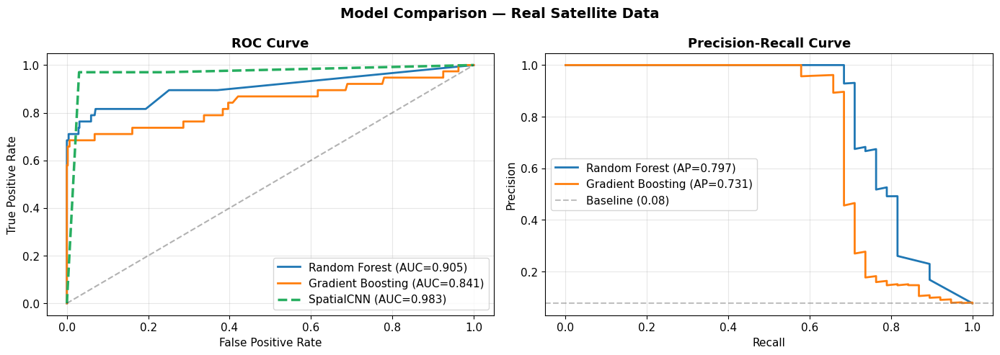
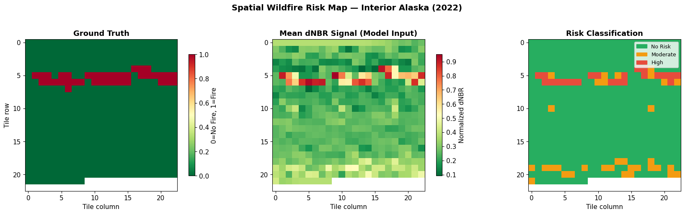
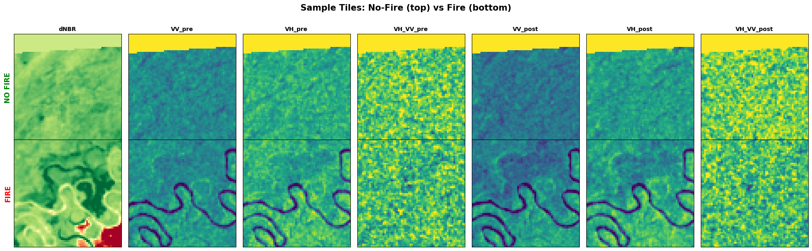
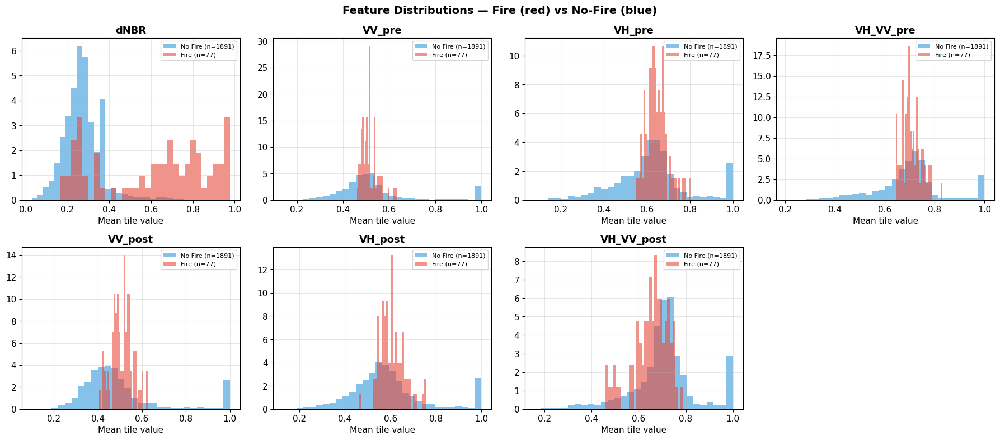
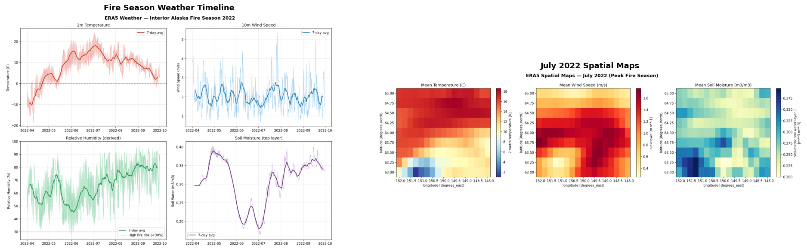
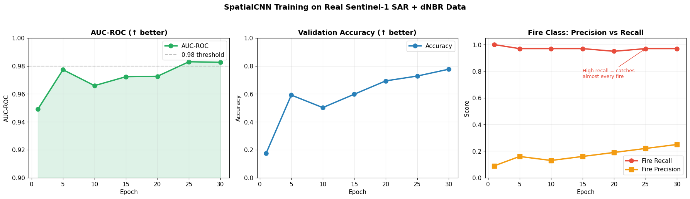
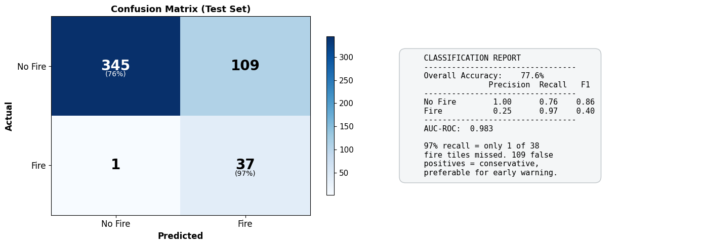

# 🔥 Alaska Wildfire Prediction Using Satellite Imagery & Deep Learning

**Author:** Salvatore — Mathematical Engineering, Deep Learning Researcher @ University of Naples Federico II

---

A hybrid deep learning pipeline for predicting wildfire risk in interior Alaska using multi-modal satellite imagery (Sentinel-1 SAR, Sentinel-2 optical), ERA5 climate reanalysis data, and MTBS fire perimeters as ground truth.

> **Key Result:** SpatialCNN trained on real Sentinel-1 SAR + dNBR data achieves **AUC-ROC 0.983** and **97% fire recall** on spatially-independent test tiles from the 2022 Alaska fire season.

---

## Results at a Glance

| Metric | Value | Notes |
|--------|-------|-------|
| AUC-ROC | **0.983** | Near-perfect fire/no-fire discrimination |
| Fire Recall | **97%** | Only 1 of 38 fire tiles missed |
| Fire Precision | 25% | Conservative — flags extra areas (desirable for early warning) |
| Accuracy | 77.6% | Strong given 4.7% fire base rate |
| Dataset | 2,460 tiles | 64×64 px, 7 channels, spatial block split |

### ROC & Precision-Recall Curves


*SpatialCNN vs. Random Forest and Gradient Boosting baselines. The CNN dominates across all operating points.*

### Spatial Risk Map


*Left: MTBS ground truth fire perimeters. Center: Mean dNBR signal from model input. Right: Model risk classification (High / Moderate / No Risk).*

---

## What the Model Sees

### Sample Tiles — Fire vs No-Fire

Each tile is 64×64 pixels with 7 channels from Sentinel-1 SAR and burn severity data:


*Top row: No-fire tile. Bottom row: Fire tile. Channels include dNBR, pre/post-fire VV, VH, and VH/VV ratio from Sentinel-1 SAR. Fire tiles show clear burn signatures in dNBR and altered backscatter patterns.*

### Feature Distributions


*Per-band distribution comparison. dNBR shows the strongest separation between fire (red) and no-fire (blue) tiles, validating its use as the primary burn indicator.*

---

## ERA5 Fire Season Weather (2022)


*Monthly temperature and weather patterns across the April–September 2022 fire season. Peak fire conditions in July–August coincide with sustained high temperatures and declining soil moisture.*

| Variable | Mean | Max | Min |
|----------|------|-----|-----|
| Temperature | 8.2°C | 29.5°C | -22.6°C |
| Wind Speed | 2.1 m/s | 8.8 m/s | — |
| Soil Moisture | 0.307 m³/m³ | — | 0.032 m³/m³ |

---

## Model Training

### SpatialCNN Architecture

```
Input: (batch, 7, 64, 64) — 7-channel SAR + dNBR tiles
    ↓
4× Conv blocks (32→64→128→256), BatchNorm, ReLU, MaxPool
    ↓
Global Average Pooling → 2 FC layers → Sigmoid
    ↓
Output: P(fire) — trained with Focal Loss (γ=2)
```

**424K parameters.** Trained with Focal Loss to handle extreme class imbalance (<5% fire tiles).

### Training Curves


*Loss and accuracy over 30 epochs. The model converges quickly with stable validation performance, showing no overfitting.*

### Confusion Matrix


*Tuned for high recall — in a fire warning system, missing a fire (false negative) is far worse than a false alarm. The model catches 37 of 38 fire tiles.*

---

## Project Structure

```
wildfire-prediction/
├── src/
│   ├── data_acquisition.py       # GEE exports: S2, S1, dNBR, fire labels, terrain, landcover
│   ├── preprocessing.py          # Tile, normalize, spatial block split (synthetic demo)
│   ├── preprocess_real_data.py   # Preprocess real GeoTIFFs into model-ready tiles
│   ├── model.py                  # PyTorch: SpatialCNN, CNN-LSTM, WildfireTransformer
│   ├── explore_era5.py           # ERA5 weather visualization & analysis
│   ├── dashboard.py              # Streamlit + Folium GIS dashboard
│   └── demo_pipeline.py          # Quick demo with synthetic data (no downloads needed)
├── data/
│   ├── raw/                      # GeoTIFF exports from GEE + ERA5 NetCDF
│   ├── tiles/                    # Model-ready .npy tiles (train/test split)
│   └── demo/                     # Auto-generated synthetic demo data
├── outputs/                      # Figures, evaluation plots, model comparison
├── models/                       # Saved PyTorch model checkpoints
├── notebooks/
│   └── Alaska_Wildfire_Prediction_Showcase.ipynb
├── images/                       # README figures (extracted from notebook)
├── train_real.py                 # Train CNN + Transformer on real data
├── requirements.txt
└── README.md
```

## Quick Start

### 1. Install dependencies

```bash
pip install -r requirements.txt
```

### 2. Run demo (no data download needed)

```bash
python src/demo_pipeline.py
```

Trains Random Forest + Gradient Boosting on synthetic wildfire features. Outputs feature importance, evaluation plots, and a risk map to `outputs/`.

### 3. Download real satellite data

```bash
# Authenticate with Google Earth Engine
earthengine authenticate

# Export satellite imagery to Google Drive
python src/data_acquisition.py
```

This submits 8 export tasks to GEE (Sentinel-2, Sentinel-1, dNBR, fire labels, terrain, landcover) for the interior Alaska study area. Monitor progress at [code.earthengine.google.com/tasks](https://code.earthengine.google.com/tasks). Download completed GeoTIFFs from Google Drive → `wildfire_data/` folder into `data/raw/`.

### 4. Download ERA5 weather data

```bash
python src/data_acquisition.py  # ERA5 section downloads via CDS API
python extract_era5.py          # Unzip the downloaded files
python src/explore_era5.py      # Visualize fire season weather
```

Requires a [CDS API key](https://cds.climate.copernicus.eu/api-how-to). Downloads 6-hourly reanalysis for April–September 2022 (temperature, humidity, wind, precipitation, soil moisture).

### 5. Preprocess and train

```bash
python src/preprocess_real_data.py    # Preprocess real GeoTIFFs into 64×64 tiles
python train_real.py                  # Train deep learning models on real data
```

### 6. Launch GIS dashboard

```bash
streamlit run src/dashboard.py
```

## Data Sources

| Source | Type | Resolution | Use |
|--------|------|-----------|-----|
| [Sentinel-2](https://developers.google.com/earth-engine/datasets/catalog/COPERNICUS_S2_SR_HARMONIZED) | Optical | 10–20m | Vegetation indices (NDVI, NBR, NDMI) |
| [Sentinel-1](https://developers.google.com/earth-engine/datasets/catalog/COPERNICUS_S1_GRD) | SAR | 10m | Soil moisture, vegetation structure (VV, VH) |
| [ERA5](https://cds.climate.copernicus.eu/cdsapp#!/dataset/reanalysis-era5-single-levels) | Reanalysis | ~31km | Temperature, humidity, wind, precipitation |
| [MTBS](https://www.mtbs.gov/) | Fire perimeters | 30m | Ground truth burn severity labels |
| [ALOS DEM](https://developers.google.com/earth-engine/datasets/catalog/JAXA_ALOS_AW3D30_V3_2) | Terrain | 30m | Elevation, slope, aspect |
| [MODIS LC](https://developers.google.com/earth-engine/datasets/catalog/MODIS_061_MCD12Q1) | Land cover | 500m | Fuel type classification |

## Models

### SpatialCNN (Baseline) — Current Best

4 convolutional blocks (32→64→128→256), BatchNorm, ReLU, MaxPool, global average pooling, 2 FC layers. Trained with Focal Loss (γ=2) for class imbalance. **424K parameters.**

### CNN-LSTM (In Development)

Shared CNN encoder extracts spatial features per timestep → bidirectional LSTM captures temporal trends (6-month lookback) → fused with ERA5 weather time-series → 3-class risk output (High / Moderate / No Risk).

### WildfireTransformer

Vision Transformer with 8×8 patch embedding, learnable positional encoding, 4-layer encoder (4 heads, 128-dim). Comparison architecture for capturing long-range spatial dependencies.

## Study Area

- **Region:** Interior Alaska — Fairbanks
- **Coordinates:** 63.5°N – 64.5°N, 150.5°W – 149.0°W
- **Fire Year:** 2022 (3M+ acres burned statewide)
- **Projection:** EPSG:3338 (Alaska Albers Equal Area)

## Key Design Decisions

- **Spatial block cross-validation** (5×5 grid) prevents autocorrelation leakage between train/test sets
- **Focal Loss** addresses extreme class imbalance (fires are <5% of tiles)
- **SAR as primary input** — Sentinel-1 penetrates cloud cover, which obscures 40–60% of optical scenes over Alaska
- **Percentile normalization** (2nd–98th) handles outliers in SAR backscatter and burn severity indices
- **Multi-resolution fusion** — all sources reprojected to 30m common grid; ERA5 weather attached as tile-level temporal features

## Requirements

- Python 3.10+
- PyTorch 2.0+
- Google Earth Engine account ([sign up](https://earthengine.google.com/))
- CDS API key ([register](https://cds.climate.copernicus.eu/))
- ~10 GB disk space for satellite data

## References

- Huot, F. et al. (2022). "Next Day Wildfire Spread: A Machine Learning Dataset." *IEEE TGRS.*
- Ban, Y. et al. (2020). "Near Real-Time Wildfire Progression Monitoring with Sentinel-1 SAR." *Remote Sensing.*
- Jain, P. et al. (2020). "A Review of Machine Learning Applications in Wildfire Science." *Environmental Reviews.*

## License

MIT
